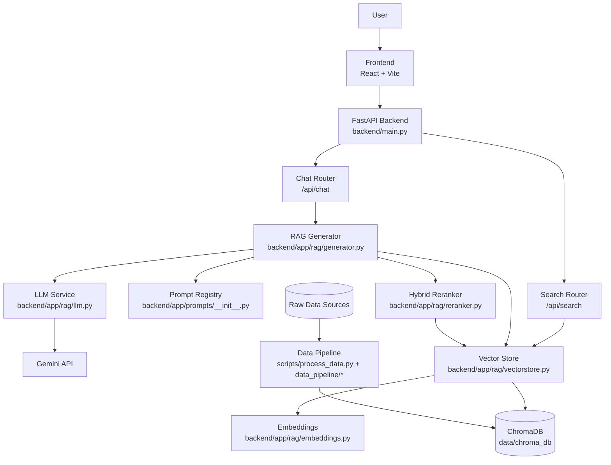
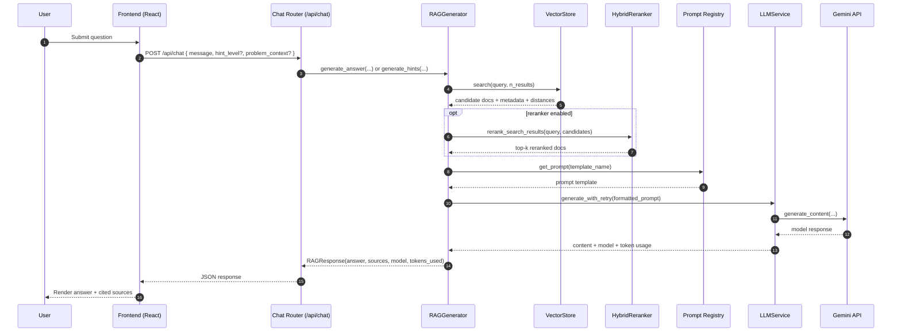
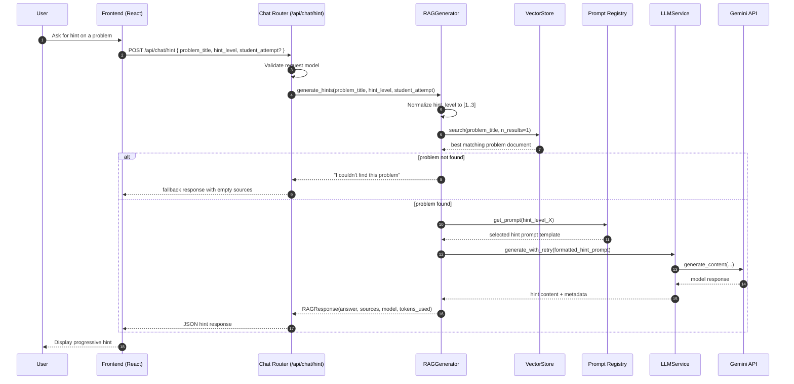

# Architecture

Swali-AI is a Retrieval-Augmented Generation (RAG) interview learning platform.

## High-level Flow

1. User asks a question from frontend.
2. FastAPI receives request in router (`/api/chat`, `/api/search`).
3. RAG generator retrieves context from ChromaDB.
4. (Optional) reranker re-orders candidates.
5. Prompt template combines context + user input.
6. Gemini model generates grounded response.
7. API returns answer + sources.

## Architecture Diagram

## Chat Request Sequence (`/api/chat`)

## Hint Request Sequence (`/api/chat/hint`)

## Components

### Backend API Layer
- Entry: `backend/main.py`
- Routers:
  - `backend/app/routers/search.py`
  - `backend/app/routers/chat.py`

Responsibilities:
- Request validation (Pydantic models)
- Route-level orchestration
- HTTP response shape

### RAG Orchestration Layer
- `backend/app/rag/generator.py`

Responsibilities:
- Run retrieval
- Build model-ready context
- Select prompt template
- Call LLM service
- Return answer + provenance metadata

### Retrieval Layer
- `backend/app/rag/vectorstore.py`
- `backend/app/rag/embeddings.py`
- `backend/app/rag/reranker.py`

Responsibilities:
- Text embedding generation
- Chroma CRUD/search operations
- Hybrid reranking for better top-k precision

### Prompt Layer
- `backend/app/prompts/__init__.py`

Responsibilities:
- Prompt templates for answer/hints/followups
- Versioning support for experimentable prompt variants

### Data Pipeline Layer
- `scripts/collect_*.py`
- `scripts/data_pipeline/*`
- `scripts/process_data.py`

Responsibilities:
- Collect raw data sources
- Normalize schema
- Deduplicate
- Build vector index

## Design Principles
- Ground generation in retrieved context.
- Keep concerns separated (router vs orchestration vs retrieval).
- Make experiments repeatable and logged.
- Prefer deterministic IDs and data transforms.
